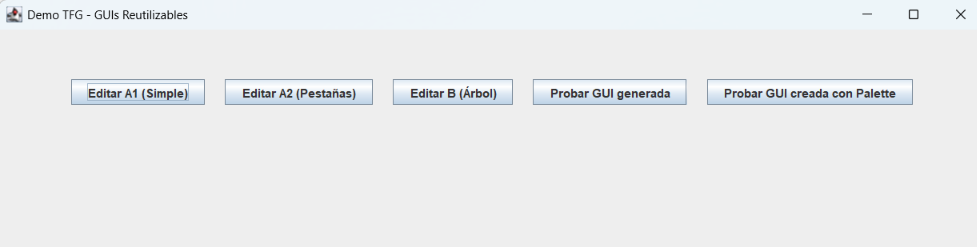

# Reusable GUI Framework

Framework for building reusable and composable graphical user interfaces with **Java Swing**, developed as a Bachelor's Thesis in Computer Engineering.

## Overview

The project provides a reusable architecture for creating modular GUIs that can be used in different contexts and combined to build more complex interfaces.

The framework centralizes common GUI behavior such as composition, recursive validation, transactional application of changes, lifecycle management, and communication between GUIs.

## Main Features

- Reuse of GUIs through class hierarchies.
- Composition of GUIs using simple, tabbed, and tree-based containers.
- Recursive validation of user-entered data.
- Transactional application and cancellation of changes.
- Messaging between GUIs through a shared context and message router.
- Demo application showing the framework in use.
- Integration with Apache NetBeans through an NBM plugin.
- Custom NetBeans template for creating reusable GUI panels.
- Swing Palette integration and drag-and-drop support.

## Technologies

- Java
- Java Swing
- Maven
- Apache NetBeans
- Object-Oriented Programming (OOP)
- Design Patterns
- Modular Software Architecture
- Unit and Integration Testing

## Project Structure

```text
reusable-gui-framework/
├── reusable-gui-parent/
│   ├── reusable-gui-lib/
│   ├── demo-app/
│   └── pom.xml
├── reusable-gui-netbeans-plugin/
│   ├── src/
│   └── pom.xml
├── README.md
└── .gitignore
```

### reusable-gui-lib

Core library containing the reusable GUI framework and its main abstractions.

### demo-app

Demonstration application used to test and showcase the main features of the framework.

### reusable-gui-netbeans-plugin

NetBeans plugin that improves framework integration with the IDE, including a custom reusable GUI template and Swing Palette support.

## Screenshots

Add screenshots here to show the project without requiring users to build it first.

Suggested screenshots:

1. Main DemoApp window.
2. Simple GUI example.
3. Tabbed GUI composition.
4. Tree-based GUI composition.
5. GUI created using the NetBeans Palette.

Example:

```markdown

```

## Build

The project uses Maven.

From the `reusable-gui-parent` directory:

```bash
mvn clean install
```

This builds the framework library and the demo application.

## NetBeans Integration

The project includes an NBM plugin for Apache NetBeans. It demonstrates IDE integration through:

- A custom **Reusable GUI Panel** template.
- Integration with the Swing **Palette**.
- Drag-and-drop creation of graphical components.

## Academic Context

This project was developed as a **Bachelor's Thesis (Trabajo de Fin de Grado)** in Computer Engineering.

Its main objective is to explore and implement mechanisms that improve the modularity, composition, and reuse of graphical user interfaces built with Java Swing.

## Author

Vicent Marco
